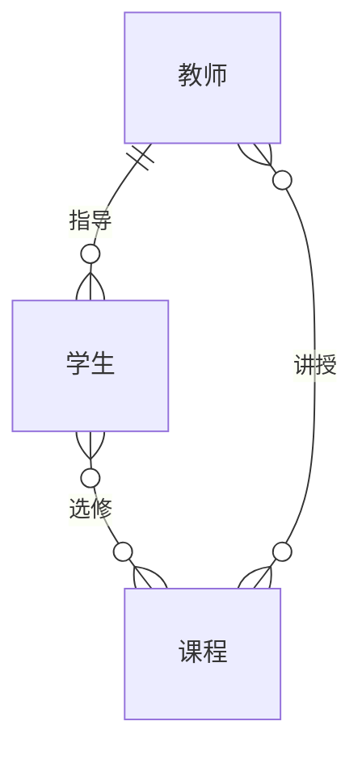
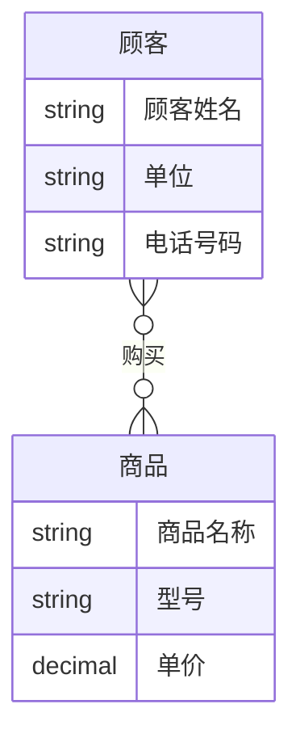
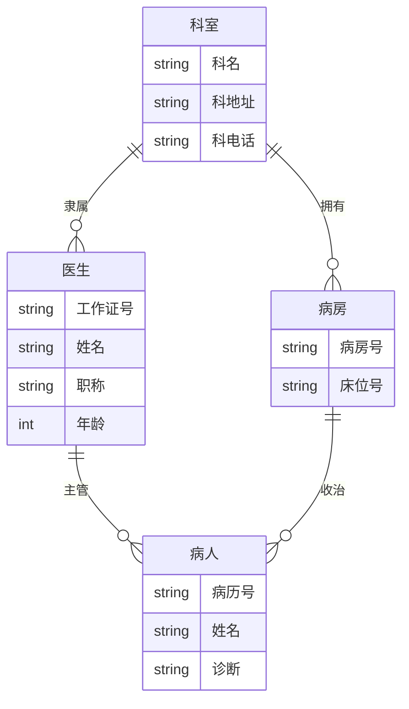

# Day 11 - 数据库70题：综合题 48-61

参考重点：教材第 7 章数据库设计，第 5 章完整性，第 11-12 章事务、恢复、并发控制。原文件缺综合题 53。

## 48. 某大学实行学分制，学生可根据自己情况选修课程。每名学生可同时选修多门课程，每门课程可由多位教师讲授；每位教师可讲授多门课程。不完整 E-R 图含学生、课程、教师三个实体。

要求：

1. 指出学生与课程的联系类型，完善 E-R 图。
2. 指出课程与教师的联系类型，完善 E-R 图。
3. 若每名学生有一位教师指导，每一位教师指导多名学生，则学生与教师是何联系？
4. 在原 E-R 图上补画教师与学生的联系。

答案：

1. 学生与课程是多对多联系。一个学生可选多门课，一门课可被多名学生选。
2. 课程与教师是多对多联系。一门课可由多位教师讲授，一位教师可讲多门课。
3. 学生与教师是多对一联系，从教师到学生看是一对多：一名学生只有一位指导教师，一位教师可指导多名学生。
4. 完整 E-R 可表示为：



讲解：E-R 联系类型判断只看业务约束。`选修` 和 `讲授` 都是 M:N，转换为关系模式时一般需要单独的联系表；`指导` 是 1:N，可在学生表中加入指导教师外键。

## 49. 将图 5.6 的 E-R 图转换为关系模式，菱形框中的属性自己确定。

题面图示：实体“单位”含属性单位号、地址、电话；实体“职工”含属性职工号、姓名、性别、年龄、单位号；单位与职工之间有联系 `D-3`。

答案：

按常见语义，一个单位有多个职工，一个职工属于一个单位，是 1:N 联系。可转换为：

- `单位(单位号, 地址, 电话)`，主键：`单位号`
- `职工(职工号, 姓名, 性别, 年龄, 单位号)`，主键：`职工号`，外键：`单位号` 引用 `单位(单位号)`

如果菱形联系 `D-3` 有自定属性，例如 `入职日期`，则该属性可并入 N 端的 `职工` 关系：

- `职工(职工号, 姓名, 性别, 年龄, 单位号, 入职日期)`

讲解：1:N 联系转换为关系模式时，一般把 1 端主键加入 N 端作为外键；只有 M:N 联系才必须单独生成联系表。

## 50. 设有商业销售记账数据库。一个顾客（顾客姓名，单位，电话号码）可以买多种商品，一种商品（商品名称，型号，单价）供应多个顾客。试画出对应的 E-R 图。

答案：

顾客和商品是多对多联系，联系可命名为“购买”或“销售”，联系属性可按记账需要加入数量、日期、金额等。



可转换为关系模式：

- `顾客(顾客姓名, 单位, 电话号码)`，主键可暂取 `顾客姓名`，实际系统建议增加 `顾客编号`
- `商品(商品名称, 型号, 单价)`，主键可取 `(商品名称, 型号)`，实际系统建议增加 `商品编号`
- `购买(顾客姓名, 商品名称, 型号, 数量, 购买日期)`，主键可取 `(顾客姓名, 商品名称, 型号, 购买日期)`

讲解：题面没有给出顾客编号和商品编号，考试可直接用自然属性作码；真实数据库设计中更建议使用稳定的代理键。

## 51. 某医院病房计算机管理中需要如下信息，并完成 E-R 图、关系模型和候选码。

题面信息：

- 科室：科名，科地址，科电话，医生姓名
- 病房：病房号，床位号，所属科室名
- 医生：姓名，职称，所属科室名，年龄，工作证号
- 病人：病历号，姓名，诊断，主管医生，病房号

约束：一个科室有多个病房、多个医生；一个病房只能属于一个科室；一个医生只属于一个科室，但可负责多个病人的诊治；一个病人的主管医生只有一个。

### 51.1 E-R 图

答案：



### 51.2 转换为关系模型结构

答案：

- `科室(科名, 科地址, 科电话)`。
- `医生(工作证号, 姓名, 职称, 年龄, 科名)`，`科名` 为外键。
- `病房(病房号, 科名)`，`科名` 为外键。
- `床位(病房号, 床位号)`，`病房号` 为外键。若题目把“病房号+床位号”整体看作病房实体，也可写成 `病房床位(病房号, 床位号, 科名)`。
- `病人(病历号, 姓名, 诊断, 主管医生工作证号, 病房号)`，主管医生和病房号为外键。

### 51.3 每个关系模式的候选码

答案：

- `科室`：`科名`
- `医生`：`工作证号`
- `病房`：`病房号`
- `床位`：`(病房号, 床位号)`
- `病人`：`病历号`

讲解：原题“科室”属性中列了“医生姓名”，但因为一个科室有多个医生，医生不应作为科室表中的多值属性，应拆成医生实体并用外键表示所属科室。

## 52. 叙述数据库实现完整性检查的方法。

答案：

DBMS 实现完整性检查一般包括：

1. 提供完整性约束定义机制，如 `PRIMARY KEY`、`FOREIGN KEY`、`UNIQUE`、`CHECK`、`NOT NULL`、触发器。
2. 在执行插入、删除、修改时自动检查约束。
3. 发现违约时执行违约处理，如拒绝操作、级联更新、级联删除、置空、置默认值。

SQL Server 示例：

```sql
CREATE TABLE dbo.Enrollment (
    Sno varchar(20) NOT NULL,
    Cno varchar(20) NOT NULL,
    Grade decimal(5, 2) NULL,
    CONSTRAINT PK_Enrollment PRIMARY KEY (Sno, Cno),
    CONSTRAINT CK_Enrollment_Grade CHECK (Grade BETWEEN 0 AND 100)
);
```

讲解：完整性检查应尽量靠 DBMS 统一执行，而不是分散在多个应用程序中。

## 54. 事务中的提交和回滚是什么意思？

答案：

- 提交：事务成功结束，使用 `COMMIT` 使所有更新永久生效。
- 回滚：事务失败或主动撤销，使用 `ROLLBACK` 撤销所有未提交更新。

讲解：提交保证持久性，回滚保证原子性。一个事务不能只完成一半后把中间状态留在数据库里。

## 55. 在数据库中为什么要有并发？

答案：

数据库需要并发是因为多个用户和多个应用常常要同时访问数据库。并发可以提高系统吞吐量、改善资源利用率、缩短用户等待时间。

讲解：并发不是问题本身，未受控制的并发才是问题。DBMS 通过并发控制在效率和一致性之间取得平衡。

## 56. 并发操作会产生几种不一致情况？用什么方法避免各种不一致的情况？

答案：

常见不一致情况：

1. 丢失修改：两个事务修改同一数据，后写覆盖先写。
2. 读脏数据：读到其他事务尚未提交且后来回滚的数据。
3. 不可重复读：同一事务两次读同一数据，中间被其他事务修改。
4. 不一致分析：统计过程中部分数据被其他事务更新，得到混合状态结果。

避免方法：

- 使用封锁机制，读加 S 锁、写加 X 锁。
- 遵循两段锁协议或严格两段锁协议。
- 使用合适隔离级别，如 SQL Server 的 `READ COMMITTED`、`REPEATABLE READ`、`SERIALIZABLE`、快照隔离。

讲解：不同隔离级别防止的问题不同。考试中若未限定，写“封锁机制和两段锁协议”最稳。

## 57. 叙述数据库中数据的一致性级别。

答案：

可按封锁协议理解一致性级别：

- 一级封锁协议：事务修改数据前加 X 锁并保持到事务结束，可防止丢失修改。
- 二级封锁协议：在一级基础上，读数据前加 S 锁，读完即可释放，可防止读脏数据。
- 三级封锁协议：在一级基础上，读数据前加 S 锁并保持到事务结束，可防止不可重复读。

讲解：一致性级别越高，隔离性越强，但并发度越低。SQL 标准隔离级别与这些封锁协议有对应关系，但具体实现由 DBMS 决定。

## 58. 叙述封锁的概念。

答案：

封锁是事务在访问某个数据对象前，先向 DBMS 请求对该对象加锁，以限制其他事务对同一对象的访问。访问结束或事务结束后释放锁。

讲解：封锁的目标是协调并发事务。常见锁类型是 S 锁和 X 锁，常见封锁粒度可以是行、页、表、数据库等。

## 59. 叙述数据库中死锁产生的原因和解决死锁的方法。

答案：

死锁产生原因：多个事务各自持有一部分锁，同时又等待对方释放锁，形成循环等待。

解决方法：

1. 死锁预防：规定统一加锁顺序，或用时间戳策略避免循环等待。
2. 死锁检测：构造等待图，若出现环则说明死锁。
3. 死锁解除：选择代价较小的事务回滚，释放其锁。
4. 超时法：等待超过阈值后主动回滚。

讲解：两段锁协议可能产生死锁，因此实际 DBMS 通常需要死锁检测和牺牲事务回滚机制。

## 60. 基本的封锁类型有几种？试述它们的含义。

答案：

基本封锁类型有两种：

- 共享锁 S：用于读。多个事务可同时对同一对象加 S 锁。
- 排他锁 X：用于写。一个事务加 X 锁后，其他事务不能再加 S 锁或 X 锁。

讲解：记忆口诀：读读可并行，读写和写写互斥。

## 61. 数据库中为什么要有恢复子系统？它的功能是什么？

答案：

数据库需要恢复子系统，是因为事务故障、系统故障、介质故障等可能导致数据库不一致或数据丢失。恢复子系统负责在故障后把数据库恢复到正确一致状态。

功能包括：

1. 维护日志和检查点。
2. 支持事务回滚，撤销失败事务。
3. 系统重启后自动恢复，REDO 已提交事务、UNDO 未提交事务。
4. 配合备份转储处理介质故障。

讲解：恢复子系统主要保证事务的原子性和持久性。
