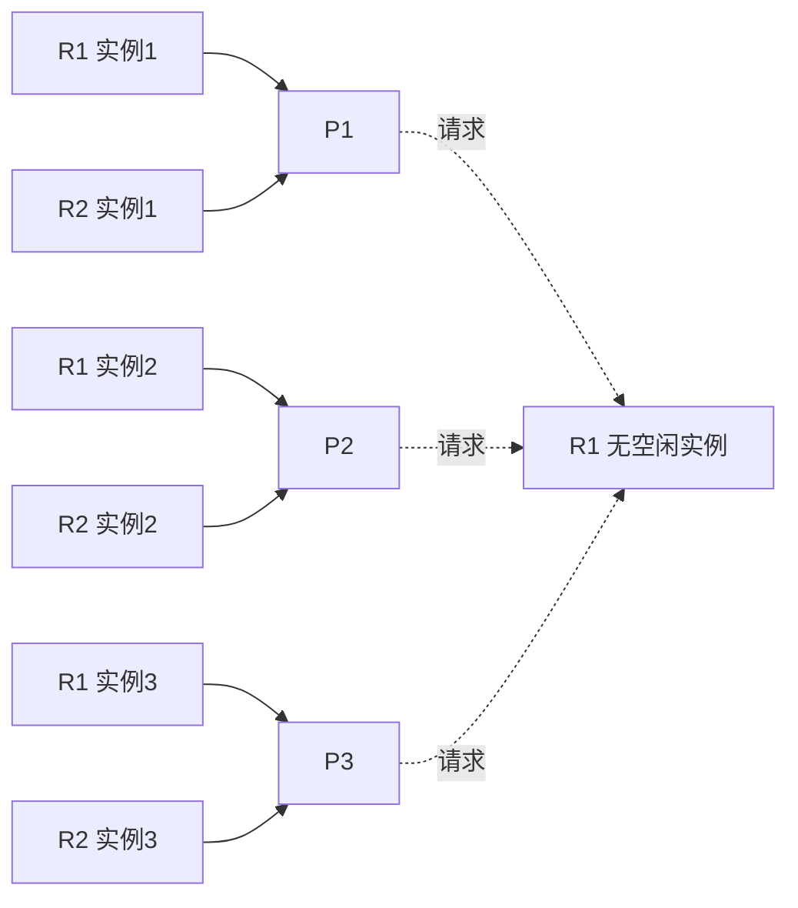

# review202505 答案讲解 04：计算题 11-20

## 11. 磁盘调度：SCAN 与 SSTF

**题意：**

> 11、假定当前磁头位于100号磁道，刚服务过80号磁道。进程对磁道的请求序列依次为55，65，39，28，90，155，145，38，170。当采用扫描算法和最短寻道时间优先算法时，总的移动的磁道数分别是多少？
>
> (1) 采用扫描算法（寻道次序、每步移动磁道数和总的移动磁道数）。
>
> (2) 最短寻道时间优先算法（寻道次序、每步移动磁道数和总的移动磁道数）。

**答案讲解：**

当前磁头位于 100，刚服务过 80，说明磁头当前移动方向是向磁道号增大的方向。

请求序列：

```text
55, 65, 39, 28, 90, 155, 145, 38, 170
```

### (1) SCAN 算法

先沿增大方向服务：

```text
145, 155, 170
```

再反向服务：

```text
90, 65, 55, 39, 38, 28
```

寻道次序：

```text
100 -> 145 -> 155 -> 170 -> 90 -> 65 -> 55 -> 39 -> 38 -> 28
```

每步移动磁道数：

```text
45, 10, 15, 80, 25, 10, 16, 1, 10
```

总移动磁道数：

```text
45 + 10 + 15 + 80 + 25 + 10 + 16 + 1 + 10 = 212
```

**答案：** SCAN 总移动 `212` 个磁道。

说明：Solutions-OS8e 11.6 对 SCAN 的定义是：磁臂沿一个方向移动，服务途中所有请求，直到到达该方向最后一个磁道或该方向已无请求，然后反向。因此题目没有给磁盘最大磁道号时，按“服务到当前方向最后一个请求 170 后折返”最贴合教材定义。若老师额外要求必须先移动到磁盘端点，例如 199 号磁道，再折返，则总移动数会变为：

```text
100 -> 199 -> 28，总移动 = 99 + 171 = 270
```

### (2) SSTF 最短寻道时间优先

每次选择离当前磁头最近的请求。

寻道次序：

```text
100 -> 90 -> 65 -> 55 -> 39 -> 38 -> 28 -> 145 -> 155 -> 170
```

每步移动磁道数：

```text
10, 25, 10, 16, 1, 10, 117, 10, 15
```

总移动磁道数：

```text
10 + 25 + 10 + 16 + 1 + 10 + 117 + 10 + 15 = 214
```

**答案：** SSTF 总移动 `214` 个磁道。

## 12. 请求分页：地址序列、LRU 与 OPT

**题意：**

> 12、在请求分页系统中，有一个长度为6页的进程，页大小为4KB。假如为它分配3个物理块，逻辑地址为：2F49, 3E98, 2A78, 1C66, 5D18, 5F63, 2C88, 6A10, 5A69, 5D87, 4F00, 3F68。地址为16进制。
>
> 问题：试求出进程访问的页面次序，采用LRU和OPT页面置换算法计算出程序访问过程中所发生的缺页次数、淘汰的页面、和缺页中断率。（说明：初始页面为空，计算为缺页。）

**答案讲解：**

页大小为 4KB：

```text
4KB = 4096B = 0x1000
```

因此每个十六进制地址的高位十六进制数就是页号，低 3 位十六进制数是页内偏移。

地址序列：

```text
2F49, 3E98, 2A78, 1C66, 5D18, 5F63, 2C88, 6A10, 5A69, 5D87, 4F00, 3F68
```

页面访问序列：

```text
2, 3, 2, 1, 5, 5, 2, 6, 5, 5, 4, 3
```

说明：题面说进程长度为 6 页，但出现页号 6。若页号严格从 0 开始，则页号 6 越界；若按教材题目意图继续做页面置换，则把它作为一次访问页 6 处理。

### OPT 算法

| 步骤 | 访问页 | 是否缺页 | 淘汰页 | 页框状态 |
| ---: | -----: | -------- | -----: | -------- |
|    1 |      2 | 是       |      - | `2`      |
|    2 |      3 | 是       |      - | `2,3`    |
|    3 |      2 | 否       |      - | `2,3`    |
|    4 |      1 | 是       |      - | `2,3,1`  |
|    5 |      5 | 是       |      1 | `2,3,5`  |
|    6 |      5 | 否       |      - | `2,3,5`  |
|    7 |      2 | 否       |      - | `2,3,5`  |
|    8 |      6 | 是       |      2 | `6,3,5`  |
|    9 |      5 | 否       |      - | `6,3,5`  |
|   10 |      5 | 否       |      - | `6,3,5`  |
|   11 |      4 | 是       |      6 | `4,3,5`  |
|   12 |      3 | 否       |      - | `4,3,5`  |

第 11 步中，`6` 和 `5` 后面都不再访问，淘汰任意一个都可以，不影响缺页次数。

OPT 缺页次数：

```text
6 次
```

OPT 淘汰页面序列：

```text
1, 2, 6
```

OPT 缺页率：

```text
6 / 12 = 50%
```

### LRU 算法

| 步骤 | 访问页 | 是否缺页 | 淘汰页 | 页框状态 |
| ---: | -----: | -------- | -----: | -------- |
|    1 |      2 | 是       |      - | `2`      |
|    2 |      3 | 是       |      - | `2,3`    |
|    3 |      2 | 否       |      - | `2,3`    |
|    4 |      1 | 是       |      - | `2,3,1`  |
|    5 |      5 | 是       |      3 | `2,5,1`  |
|    6 |      5 | 否       |      - | `2,5,1`  |
|    7 |      2 | 否       |      - | `2,5,1`  |
|    8 |      6 | 是       |      1 | `2,5,6`  |
|    9 |      5 | 否       |      - | `2,5,6`  |
|   10 |      5 | 否       |      - | `2,5,6`  |
|   11 |      4 | 是       |      2 | `4,5,6`  |
|   12 |      3 | 是       |      6 | `4,5,3`  |

LRU 缺页次数：

```text
7 次
```

LRU 淘汰页面序列：

```text
3, 1, 2, 6
```

LRU 缺页率：

```text
7 / 12 ≈ 58.33%
```

**答案汇总：**

| 算法 | 缺页次数 | 淘汰页面序列 | 缺页率 |
| ---- | -------: | ------------ | -----: |
| OPT  |        6 | `1, 2, 6`    |    50% |
| LRU  |        7 | `3, 1, 2, 6` | 58.33% |

## 13. 信号量当前值与资源、等待进程数

**题意：**

> 13、设与某资源相关联的信号量初值为3，当前值为1，若M表示该资源的可用个数，N表示等待资源的进程数，则M,N分别是多少？

**答案讲解：**

信号量含义：

1. 当 `S >= 0` 时，`S` 表示当前可用资源数，等待进程数为 0。
2. 当 `S < 0` 时，资源可用数为 0，等待进程数为 `-S`。

当前信号量值：

```text
S = 1
```

因为 `S >= 0`，所以：

```text
M = 1
N = 0
```

**答案：** `M = 1，N = 0`。

## 14. 图像存储空间

**题意：**

> 14、计算机系统中，屏幕显示分辨率为1024x768，若要存储一屏256彩色的图像，需要多少字节存储空间？

**答案讲解：**

256 色需要的位数：

```text
log2(256) = 8 bit
```

8 bit 等于 1 byte，所以每个像素需要 1 字节。

像素总数：

```text
1024 × 768 = 786,432
```

存储空间：

```text
786,432 × 1B = 786,432B
```

换算为 KB：

```text
786,432B / 1024 = 768KB
```

**答案：** 需要 `786,432B`，即 `768KB`。

## 15. 八进制虚拟地址转换为物理地址

**题意：**

> 15、系统提供24位虚存空间，主存为2^18B，分页式虚拟存储管理，页面尺寸为2KB。用户程序虚拟地址11124457(八进制)，页面分得块号为100(八进制)，求物理地址？

**答案讲解：**

页面大小：

```text
2KB = 2048B = 2^11 = 4000(8)
```

虚拟地址为：

```text
11124457(8)
```

按页大小拆分虚拟地址：

```text
11124457(8) / 4000(8)
= 页号 2225(8)，页内偏移 0457(8)
```

题目给出该页分得物理块号：

```text
100(8)
```

物理地址：

```text
物理地址 = 物理块号 × 页面大小 + 页内偏移
         = 100(8) × 4000(8) + 0457(8)
         = 400457(8)
```

换成十六进制：

```text
400457(8) = 0x2012F
```

**答案：** 物理地址为 `400457(8)`，即 `0x2012F`。

## 16. 符号链接、硬链接和引用计数

**题意：**

> 16、设文件F1当前引用计数值为1，先建立F1的符号链接文件F2，再建立F1的硬链接文件F3，然后删除F1。此时，F2和F3的引用计数值分别是多少？

**答案讲解：**

分析过程：

1. 初始时，F1 的引用计数为 1。
2. 建立 F1 的符号链接 F2。符号链接是一个独立文件，内容保存目标路径，不增加 F1 的 inode 引用计数。
3. 建立 F1 的硬链接 F3。硬链接与 F1 指向同一个 inode，使该 inode 引用计数从 1 变为 2。
4. 删除 F1。删除的只是 F1 这个目录项，该 inode 引用计数从 2 减为 1。

此时：

1. F2 是符号链接文件，它自身的引用计数仍为 1；但由于路径名 F1 被删除，F2 可能成为悬空符号链接。
2. F3 指向原 F1 的 inode，该 inode 当前引用计数为 1。

**答案：** `F2` 的引用计数为 `1`，`F3` 指向的文件 inode 引用计数为 `1`。

## 17. 虚地址 0BEBC 转换为实地址

**题意：**

> 17、假设某虚存的用户空间为1024KB，页面大小为4KB，内存空间为512KB。已知用户的虚页10、11、12、13页分得内存页框号为62、78、25、36，求出虚地址0BEBC(16进制)的实地址(16进制)是多少?

**答案讲解：**

页面大小：

```text
4KB = 4096B = 0x1000
```

虚地址：

```text
0BEBC(16)
```

拆分为页号和页内偏移：

```text
页号 = 0xB = 11
页内偏移 = 0xEBC
```

题目给出：

```text
虚页 11 -> 页框 78
```

页框号 78 转为十六进制：

```text
78(10) = 0x4E
```

实地址：

```text
0x4E000 + 0xEBC = 0x4EEBC
```

**答案：** 实地址为 `4EEBC(16)`。

## 18. UNIX/Linux 文件偏移对应几次间接

**题意：**

> 18、一个UNIX/Linux文件，如果一个盘块的大小为1KB，每个盘块占4个字节，那么，若进程欲访问偏移为263168字节处的数据，需经过几次间接？

**答案讲解：**

题目中的“每个盘块占 4 个字节”通常应理解为“每个盘块指针或盘块地址占 4 个字节”。

每个间接索引块可存放的指针数：

```text
1KB / 4B = 1024 / 4 = 256
```

访问偏移：

```text
263168B
```

对应逻辑块号：

```text
263168 / 1024 = 257
```

即访问第 257 号逻辑块，按从 0 开始编号。

Solutions-OS8e 12.12 的 UNIX inode 例题采用 `10` 个直接块；本复习卷第 4 题采用 `12` 个直接块。无论取 10 还是 12，本题逻辑块 257 都落在一级间接范围内。若按 Solutions-OS8e 12.12 的 10 个直接块：

```text
直接块：0 - 9
一级间接：10 - 265
```

逻辑块 257 落在一级间接范围内。

**答案：** 需经过 `1` 次间接，即一级间接。

## 19. 5 个作业的 FCFS、SJF、HRRN 调度

**题意：**

> 19、如果在一段时间内先后有5个作业，它们提交和运行时间由下表给出。

| 序号 | 提交 | 运行时间 | 开始 | 结束 | 周转时间 | 带权周转时间 |
| ---: | ---: | -------: | ---: | ---: | -------: | -----------: |
|    1 | 8:00 |       50 |      |      |          |              |
|    2 | 8:15 |       30 |      |      |          |              |
|    3 | 8:20 |       20 |      |      |          |              |
|    4 | 8:25 |       20 |      |      |          |              |
|    5 | 8:30 |       10 |      |      |          |              |

> 问题：(1) 分别使用先来先服务、最短进程优先和最高响应比算法完成上表，给出各个作业的开始时间、完成时间、周转时间和带权周转时间；
>
> (2) 计算各算法的平均作业周转时间和平均作业带权周转时间。

**答案讲解：**

计算公式：

```text
周转时间 = 完成时间 - 提交时间
带权周转时间 = 周转时间 / 运行时间
```

### (1) FCFS 先来先服务

调度顺序：

```text
J1 -> J2 -> J3 -> J4 -> J5
```

| 作业 | 提交 | 运行时间 |  开始 |  结束 | 周转时间 | 带权周转时间 |
| ---: | ---: | -------: | ----: | ----: | -------: | -----------: |
|    1 | 8:00 |       50 |  8:00 |  8:50 |       50 |         1.00 |
|    2 | 8:15 |       30 |  8:50 |  9:20 |       65 |         2.17 |
|    3 | 8:20 |       20 |  9:20 |  9:40 |       80 |         4.00 |
|    4 | 8:25 |       20 |  9:40 | 10:00 |       95 |         4.75 |
|    5 | 8:30 |       10 | 10:00 | 10:10 |      100 |        10.00 |

平均周转时间：

```text
(50 + 65 + 80 + 95 + 100) / 5 = 78
```

平均带权周转时间：

```text
(1.00 + 2.17 + 4.00 + 4.75 + 10.00) / 5 ≈ 4.38
```

### (2) SJF 最短进程优先

J1 到达时只有 J1，因此先运行 J1。J1 完成后所有作业均已到达，按运行时间从短到长选择。

调度顺序：

```text
J1 -> J5 -> J3 -> J4 -> J2
```

| 作业 | 提交 | 运行时间 | 开始 |  结束 | 周转时间 | 带权周转时间 |
| ---: | ---: | -------: | ---: | ----: | -------: | -----------: |
|    1 | 8:00 |       50 | 8:00 |  8:50 |       50 |         1.00 |
|    2 | 8:15 |       30 | 9:40 | 10:10 |      115 |         3.83 |
|    3 | 8:20 |       20 | 9:00 |  9:20 |       60 |         3.00 |
|    4 | 8:25 |       20 | 9:20 |  9:40 |       75 |         3.75 |
|    5 | 8:30 |       10 | 8:50 |  9:00 |       30 |         3.00 |

平均周转时间：

```text
(50 + 115 + 60 + 75 + 30) / 5 = 66
```

平均带权周转时间：

```text
(1.00 + 3.83 + 3.00 + 3.75 + 3.00) / 5 ≈ 2.92
```

### (3) HRRN 最高响应比优先

响应比公式：

```text
响应比 = (等待时间 + 服务时间) / 服务时间
       = 1 + 等待时间 / 服务时间
```

J1 到达时只有 J1，因此先运行 J1。8:50 时各作业响应比：

| 作业 | 等待时间 | 服务时间 | 响应比 |
| ---: | -------: | -------: | -----: |
|   J2 |       35 |       30 |   2.17 |
|   J3 |       30 |       20 |   2.50 |
|   J4 |       25 |       20 |   2.25 |
|   J5 |       20 |       10 |   3.00 |

选择 J5。继续计算可得调度顺序：

```text
J1 -> J5 -> J3 -> J4 -> J2
```

因此本题 HRRN 与 SJF 结果相同：

| 作业 | 提交 | 运行时间 | 开始 |  结束 | 周转时间 | 带权周转时间 |
| ---: | ---: | -------: | ---: | ----: | -------: | -----------: |
|    1 | 8:00 |       50 | 8:00 |  8:50 |       50 |         1.00 |
|    2 | 8:15 |       30 | 9:40 | 10:10 |      115 |         3.83 |
|    3 | 8:20 |       20 | 9:00 |  9:20 |       60 |         3.00 |
|    4 | 8:25 |       20 | 9:20 |  9:40 |       75 |         3.75 |
|    5 | 8:30 |       10 | 8:50 |  9:00 |       30 |         3.00 |

平均周转时间：

```text
66
```

平均带权周转时间：

```text
约 2.92
```

## 20. 固定资源申请顺序与死锁

**题意：**

> 20、某系统有R1设备3台，R2设备4台，它们被P1、P2、P3和P4进程共享，且已知这4个进程均按以下顺序使用设备：
>
> →申请R1→申请R2→申请R1→释放R1→释放R2→释放R1
>
> 系统运行中可能产生死锁吗？为什么？
>
> 若可能的话，请举出一种情况，并画出表示该死锁状态的进程—资源图。

**答案讲解：**

资源数量：

```text
R1 有 3 台
R2 有 4 台
```

每个进程的资源使用顺序：

```text
申请 R1 -> 申请 R2 -> 申请 R1 -> 释放 R1 -> 释放 R2 -> 释放 R1
```

每个进程最多需要：

```text
R1: 2 台
R2: 1 台
```

### 是否可能死锁

可能产生死锁。

构造一种状态：

1. P1、P2、P3 各自已经申请到第 1 台 R1。
2. P1、P2、P3 又各自申请到 1 台 R2。
3. 此时 3 台 R1 全部被 P1、P2、P3 占有。
4. P1、P2、P3 都继续申请第 2 台 R1。
5. 系统中已无空闲 R1，而这些进程只有申请到第 2 台 R1 后才会执行释放操作。

于是 P1、P2、P3 都持有资源并等待 R1，没有任何一个能继续运行到释放资源的位置，因此形成死锁。

### 进程—资源图文字表示

已分配边：

```text
R1_1 -> P1
R1_2 -> P2
R1_3 -> P3

R2_1 -> P1
R2_2 -> P2
R2_3 -> P3
```

请求边：

```text
P1 -> R1
P2 -> R1
P3 -> R1
```

由于 R1 的 3 个实例都已分配出去，P1、P2、P3 又都请求新的 R1 实例，且它们不释放已占资源，因此死锁成立。

可用 Mermaid 图表示：



**答案：** 系统运行中可能产生死锁。典型死锁状态是 P1、P2、P3 各持有 1 台 R1 和 1 台 R2，同时都请求第 2 台 R1，而 R1 已无空闲实例，导致它们均无法继续执行并释放资源。
